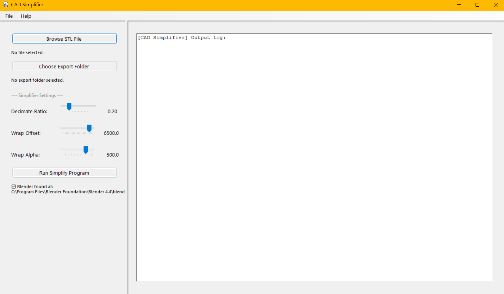

CAD Simplifier
==============

**CAD Simplifier** is a cross-platform Python application that simplifies CAD files by converting complex models into optimized ``.glb`` or ``.fbx`` files with reduced polygon counts.

This tool uses advanced mesh processing techniques to create optimized versions of 3D CAD models, making them more efficient for use in real-time applications such as games or augmented reality.

Features
--------

- **CAD to STL Conversion**: Converts heavy STEP files using FreeCAD.
- **Mesh Decimation**: Reduces polygon count for improved performance via Blender's Decimate modifier.
- **CGAL Alpha Wrapping**: Uses CGAL Alpha Wrapping_ to generate cleaner and more uniform topology.
  
  - **Alpha**: Determines which facets are included in the wrap.
  - **Offset**: The distance of the new facets from the original mesh.

- **Automated Workflow**: Orchestrates multiple software tools into a single-click process.

Software Requirements
---------------------

To run this application, you must have the following software installed. The app automatically searches for these in standard installation paths.

+------------+----------------------+------------------------------------------------------------+
| Software   | Supported Versions   | Notes                                                      |
+============+======================+============================================================+
| **Blender**| 3.x or 4.x           | Required for mesh decimation and FBX/GLB export.           |
+------------+----------------------+------------------------------------------------------------+
| **FreeCAD**| 0.21 or higher       | Specifically requires ``FreeCADCmd`` (Command Line).       |
+------------+----------------------+------------------------------------------------------------+
| **Python** | 3.8 – 3.12           | Required for development and running via Briefcase.        |
+------------+----------------------+------------------------------------------------------------+

Setting Paths for Blender and FreeCAD
-------------------------------------

The application logic attempts to locate these tools automatically in the following order:

1. **System PATH**  
   If you can run ``blender`` or ``FreeCADCmd`` from your terminal, the app will find them.

2. **Standard Directories**

   - **Windows**:  
     ``%ProgramFiles%\Blender Foundation``  
     ``%ProgramFiles%\FreeCAD 0.21\bin\FreeCADCmd.exe``

   - **macOS**:  
     ``/Applications/Blender.app``  
     ``/Applications/FreeCAD.app``

   - **Linux**:  
     ``/usr/bin/``  
     ``/snap/bin/``  
     ``/usr/local/bin/``

.. note::
   If your software is installed in a custom location, add the directory containing the executable to your system's environment variables (PATH).

How to Setup and Run (Development)
----------------------------------

1. **Clone the Repository**

   .. code-block:: bash

      git clone https://github.com/jaiecodes/CADSimplifyApp.git
      cd simplifyapp

2. **Create a Virtual Environment**

   .. code-block:: bash

      # Windows
      python -m venv venv
      venv\Scripts\activate

      # macOS / Linux
      python3 -m venv venv
      source venv/bin/activate

3. **Install Briefcase**

   .. code-block:: bash

      pip install briefcase

4. **Run in Development Mode**

   .. code-block:: bash

      briefcase dev

Packaging the App
-----------------

To create a native installer for your operating system:

.. code-block:: bash

   briefcase create
   briefcase build
   briefcase package

About
-----

**This cross-platform app was generated by** Briefcase_ – part of The BeeWare Project_.

.. _CGAL Alpha Wrapping: https://doc.cgal.org/latest/Alpha_wrap_3
.. _Python API: https://docs.blender.org/api/current/
.. _Briefcase: https://briefcase.readthedocs.io/
.. _The BeeWare Project: https://beeware.org/
